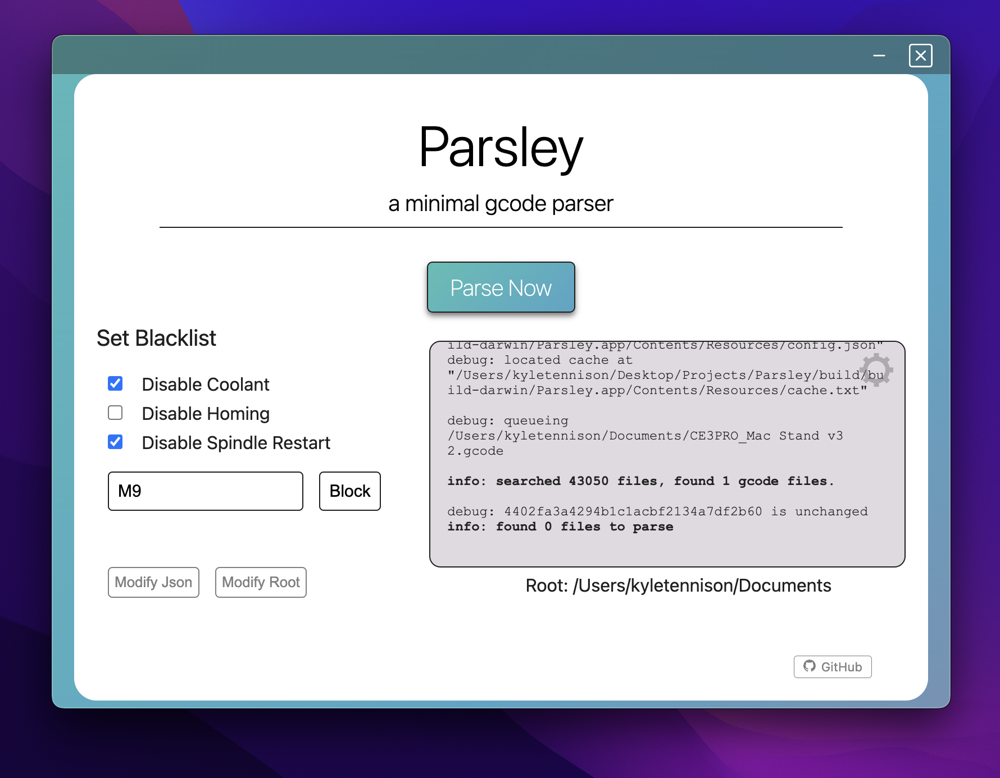

# Parsley 🍃



## What does it do?

Gcode is the universal language for toolpaths; it's used from 3D Printers to Hass Milling Machines. Unfortunately, being such a cross-compatible language tends to bring compatibility issues.

Erroneous lines that are intended for different machines can easily lead to tool crashes and unexpected behavior. Luckily, these lines are easy to remove manually, but the process can be tedious; this is where Parsley comes in. Parsley recursively scans your filesystem and fixes conflicting gcode files.

## Installation 📦

### Standard Install

Parsley is supported on Windows x64 and Apple Silicon. See the [releases page]() for installs.

### CLI

Parsley's heavy-lifing happens in Rust. If you aren't interested in the (very pretty) UI, the Rust can be executed by itself.

`parsley-inner/` contains a crate. To build this crate, run `cargo build`.

If you try to run the `parsley-inner` binary, you'll see:

```bash
$ parsly-inner
error: missing arguments
    usage: parsley-inner <root-dir> <storage-dir>
```

- `root-dir` refers to the root directory to recursively search through
- `storage-dir` refers to a directory that contains the cache\* and a `config.json` file, which should contain the gcode blacklist.

An example `config.json` is:

```json
{
  {
  "blacklist": [
    "M7",
    "M3",
    "G28 G91 Z0."
  ],
  "root": "/Users/someguy"
  }
}
```

_\* The cache is automatically generated_

## Building 🛠️

If you are interested in contributing, here is some information I would've found helpful.

### Building For windows

Create `~/.cargo/config` and add

```
[target.x86_64-pc-windows-gnu]
linker = "x86_64-w64-mingw32-gcc"
ar = "x86_64-w64-mingw32-gcc-ar"
```

Install `mingw-w64`

Macos: `brew install mingw-w64`
Linux: `sudo apt install mingw-w64`

Build the target
`rustup target add x86_64-pc-windows-gnu` (maybe optional)
`cargo build --target x86_64-pc-windows-gnu`
